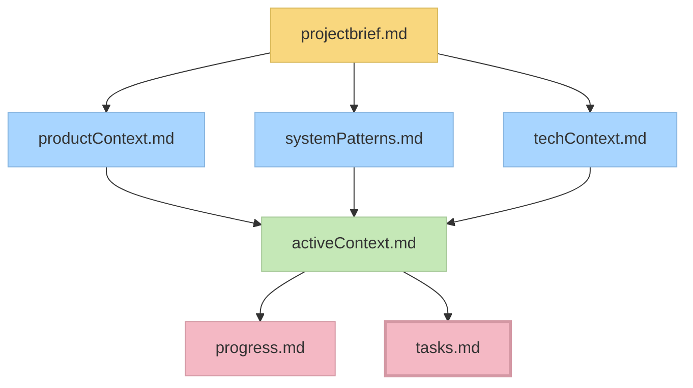
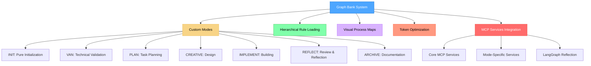

# Graph Bank System - AI 輔助開發代理系統

## 專案概述

Graph Bank System 是一個先進的 AI 輔助開發系統，專為優化 Cursor 編輯器中的 AI 輔助開發工作流程而設計。本系統採用分層規則載入架構和記憶銀行（Memory Bank）技術，提供結構化的開發流程和跨會話的上下文維護。

### 核心特色

- **🎯 分層規則載入**：僅載入當前階段所需的規則，優化 Token 使用效率
- **🧠 記憶銀行系統**：維護跨會話的開發上下文和專案狀態
- **🔄 多模式架構**：專門化的開發模式，每個模式針對特定開發階段優化
- **📊 複雜度適應**：基於 1-4 級複雜度系統的適應性工作流程
- **🎨 Claude Think Tool 整合**：基於 Anthropic Claude 的結構化思考方法論

## 系統架構

### Memory Bank 架構



### 模式系統架構



## 開發模式說明

### 🚀 INIT Mode - 純初始化模式

**用途**：Graph Bank 基礎結構創建

- Graph Bank 目錄結構創建
- 核心檔案初始化（tasks.md, activeContext.md, progress.md, projectbrief.md）
- 子目錄創建（creative/, reflection/, archive/）
- 結構完整性驗證
- 記憶銀行狀態更新

### 🔍 VAN Mode - 技術驗證模式

**用途**：專案初始化和複雜度評估

- 平台檢測和文件驗證
- 專案結構分析
- 複雜度等級確定（1-4 級）
- 開發環境配置

### 📋 PLAN Mode - 規劃模式

**用途**：任務規劃和實施策略制定

- 需求分析和組件識別
- 實施策略制定
- 依賴關係分析
- 創意階段組件標記

### 🎨 CREATIVE Mode - 創意模式

**用途**：設計決策和架構探索

- 多選項設計探索
- 優缺點分析
- 架構決策制定
- 實施指導原則

### ⚒️ IMPLEMENT Mode - 實施模式

**用途**：系統化代碼實施

- 按計劃實施組件
- 命令執行和測試
- 進度追蹤
- 整合驗證

### 🔍 REFLECT Mode - 反思模式

**用途**：代碼審查和經驗總結（整合 LangGraph Reflection）

- LLM-as-a-Judge 評估機制
- Codacy 靜態代碼分析
- 反思圖創建和迭代改進循環
- 實施結果評估
- 經驗教訓總結
- 改進建議生成
- 知識文檔化

### 📚 ARCHIVE Mode - 歸檔模式

**用途**：專案文檔和知識保存

- 綜合文檔創建
- 知識庫更新
- 專案總結
- 最佳實踐記錄

## 複雜度等級系統

### Level 1: 快速修復

- **適用場景**：簡單的 Bug 修復
- **工作流程**：INIT → VAN → IMPLEMENT → REFLECT
- **文檔要求**：最小化文檔模板

### Level 2: 簡單增強

- **適用場景**：功能增強和小型改進
- **工作流程**：INIT → VAN → PLAN → IMPLEMENT → REFLECT
- **文檔要求**：簡化規劃模板

### Level 3: 中級功能

- **適用場景**：新功能開發
- **工作流程**：INIT → VAN → PLAN → CREATIVE → IMPLEMENT → REFLECT → ARCHIVE
- **文檔要求**：全面規劃和創意探索

### Level 4: 企業級系統

- **適用場景**：複雜系統開發
- **工作流程**：完整七階段流程
- **文檔要求**：分層文檔模板和治理控制

## 使用指南

### 基本命令

```bash
INIT       # 純初始化 Graph Bank 結構
VAN        # 技術驗證並確定複雜度
PLAN       # 創建詳細實施計劃
CREATIVE   # 探索複雜組件的設計選項
IMPLEMENT  # 系統化構建計劃組件
REFLECT    # 反思總結並品質評估
ARCHIVE    # 創建綜合文檔和知識保存
QA         # 技術驗證（可從任何模式調用）
```

### 典型工作流程

1. **開始開發**：使用 `INIT` 命令創建 Graph Bank 結構
2. **技術驗證**：使用 `VAN` 命令進行技術驗證和複雜度確定
3. **規劃階段**：根據複雜度等級進入 `PLAN` 模式
4. **創意探索**：對需要設計決策的組件使用 `CREATIVE` 模式
5. **實施階段**：使用 `IMPLEMENT` 模式系統化構建
6. **反思總結**：使用 `REFLECT` 模式進行品質評估和經驗總結
7. **文檔歸檔**：使用 `ARCHIVE` 模式保存知識和最佳實踐

## 技術特色

### Claude Think Tool 整合

Graph Bank 的 CREATIVE 模式基於 Anthropic Claude 的 "Think" 工具方法論：

- **結構化思考過程**：將複雜問題分解為可管理組件
- **明確推理**：清楚記錄推理過程
- **選項探索**：系統化探索多種解決方案
- **權衡分析**：評估不同選項的優缺點
- **決策文檔化**：創建決策記錄和理由

### Token 優化技術

- **分層規則載入**：僅載入當前階段所需的規則
- **規則快取**：跨模式快取共享規則
- **延遲載入**：按需載入專門規則
- **複雜度選擇**：基於任務複雜度的規則選擇
- **MCP 服務優化**：最小化服務載入，預期節省 25-35% token 使用

### 視覺化流程圖

每個模式都包含嵌入的 Mermaid 圖表，提供：

- 清晰的視覺指導
- 決策點和條件分支
- 進度檢查點
- 模式轉換路徑

## 專案狀態

### 當前版本

- **版本**：v0.8-beta
- **狀態**：積極開發中
- **主要改進**：完整七模式系統、MCP 服務整合、LangGraph Reflection

### 系統要求

- **Cursor 編輯器**：版本 0.48 或更高
- **AI 模型**：Claude 4 Sonnet 或 Claude 4 Opus（推薦）
- **自定義模式**：必須在 Cursor 中啟用

### 發展方向

- 動態模板生成
- 自動上下文摘要
- 跨任務知識保存
- MCP 整合改進
- LangGraph Reflection 深度整合
- 自動模式切換優化

## MCP 服務整合架構

Graph Bank System 現在整合了完整的 MCP (Model Context Protocol) 服務架構，每個模式都自動載入適當的 MCP 服務：

### 核心 MCP 服務（所有模式）

- **filesystem.mdc**：檔案系統操作
- **memory.mdc**：記憶銀行系統
- **sequential-thinking.mdc**：結構化思考工具

### 模式特定 MCP 服務

- **INIT**：最小服務（僅核心服務）
- **VAN**：repomix（專案分析）
- **PLAN**：context7, fetch（技術研究）
- **CREATIVE**：context7, fetch（設計研究）
- **IMPLEMENT**：codacy, chrome-devtools, playwright, context7（開發工具套件）
- **REFLECT**：codacy（代碼審查和反思）
- **ARCHIVE**：最小服務（僅核心服務）

### LangGraph Reflection 整合

- **LLM-as-a-Judge 機制**：使用單獨的 LLM 作為評判者
- **代碼驗證反思**：使用 Codacy 進行靜態分析
- **反思圖創建**：結合助手圖和評判圖的反思系統
- **迭代改進循環**：品質不通過時自動回到改進

## MCP 觸發對照表

Graph Bank System 整合了多個 MCP (Model Context Protocol) 服務，提供豐富的 AI 輔助功能。以下是常用的觸發對照表：

### 核心 MCP 服務

| 觸發代碼 | MCP 服務            | 功能描述       | 主要用途               | 規則文件                                | 支援版本 |
| -------- | ------------------- | -------------- | ---------------------- | --------------------------------------- | -------- |
| `st7`    | sequential-thinking | 結構化思考工具 | 複雜問題分析、決策制定 | `.cursor/rules/sequential-thinking.mdc` | v1.0+    |
| `uc7`    | Context7            | 程式庫文檔查詢 | 技術文檔檢索、API 參考 | `.cursor/rules/context7.mdc`            | v1.0+    |
| `mem7`   | memory              | 記憶銀行系統   | 跨會話知識保存         | `.cursor/rules/memory.mdc`              | v1.0+    |
| `fs7`    | filesystem          | 檔案系統操作   | 檔案讀寫、目錄管理     | `.cursor/rules/filesystem.mdc`          | v1.0+    |
| `fetch7` | fetch               | 網路內容獲取   | 網頁抓取、API 調用     | `.cursor/rules/fetch.mdc`               | v1.0+    |
| `pw7`    | playwright          | 瀏覽器自動化   | 網頁測試、截圖         | `.cursor/rules/playwright.mdc`          | v1.0+    |
| `rmx7`   | repomix-docker      | 程式碼分析     | 專案結構分析           | `.cursor/rules/repomix.mdc`             | v1.0+    |

**rmx7 標準執行命令（雙輸出格式）：**

```bash
# 輸出 Markdown 格式
npx repomix --ignore "node_modules/**,yarn.lock,.gitignore,.editorconfig,README.md,**/angular-fire-rolekit/**,.angular/**,public/**,*.spec.ts,*.spec.js,firebase.json,tsconfig.spec.json" --include "src/**/*.ts,src/**/*.html,src/**/*.scss,angular.json,package.json,tsconfig.json,tsconfig.app.json" --compress --style markdown --output ./angular/angular-dev-focused.md

# 輸出 XML 格式
npx repomix --ignore "node_modules/**,yarn.lock,.gitignore,.editorconfig,README.md,**/angular-fire-rolekit/**,.angular/**,public/**,*.spec.ts,*.spec.js,firebase.json,tsconfig.spec.json" --include "src/**/*.ts,src/**/*.html,src/**/*.scss,angular.json,package.json,tsconfig.json,tsconfig.app.json" --compress --style xml --output ./angular/angular-dev-analysis.xml
```

| `cdt7` | Chrome DevTools | 瀏覽器除錯 | 網頁除錯、效能分析 | `.cursor/rules/chrome-devtools.mdc` | v1.0+ |
| `codacy7` | codacy | 程式碼品質檢查 | 靜態分析、安全檢查 | `.cursor/rules/codacy.mdc` | v1.0+ |

### 使用範例

#### 完整技術分析工作流程

```bash
# 步驟 1: 使用 st7 查看資料夾結構
st7: 分析當前專案目錄結構，識別所有技術相關檔案

# 步驟 2: 使用 st7 分析技術棧
st7: 基於檔案結構分析專案使用的技術和框架

# 步驟 3: 使用 uc7 查詢技術現代化程度
uc7: 查詢 MCP (Model Context Protocol) 最新版本和最佳實踐
uc7: 查詢 Node.js 和相關工具的最新發展趨勢

# 步驟 4: 使用 st7 分析更新需求
st7: 比較當前技術棧與現代化標準，識別需要更新的部分
st7: 制定技術升級計劃和優先順序
```

#### 結構化思考與分析

```bash
# 複雜問題分析
st7: 分析微服務架構與單體架構的優缺點，考慮可擴展性和維護性

# 技術文檔查詢
uc7: React 18 Hooks API 參考和最佳實踐
uc7: Next.js 14 App Router 路由配置

# 記憶管理
mem7: 記錄專案架構決策：選擇 TypeScript 的原因
mem7: 保存使用者偏好：偏好使用 Tailwind CSS
```

#### 檔案與網路操作

```bash
# 檔案系統操作
fs7: 讀取 package.json 並分析依賴關係
fs7: 創建新的組件目錄結構

# 網路內容獲取
fetch7: 獲取 GitHub API 最新版本資訊
fetch7: 抓取技術部落格文章內容
```

#### 瀏覽器自動化與測試

```bash
# Playwright 自動化
pw7: 截取網站首頁並保存為 PNG
pw7: 自動填寫表單並提交測試

# Chrome DevTools 除錯
cdt7: 分析網頁載入效能和 Core Web Vitals
cdt7: 檢查 JavaScript 錯誤和網路請求
```

#### 程式碼分析與品質檢查

```bash
# Repomix 程式碼分析 - 標準執行方式
rmx7: 分析專案結構並生成程式碼摘要
# 執行命令：
npx repomix --ignore "node_modules/**,yarn.lock,.gitignore,.editorconfig,README.md,**/angular-fire-rolekit/**,.angular/**,public/**,*.spec.ts,*.spec.js,firebase.json,tsconfig.spec.json" --include "src/**/*.ts,src/**/*.html,src/**/*.scss,angular.json,package.json,tsconfig.json,tsconfig.app.json" --compress --style markdown --output ./angular/angular-dev-focused.md

# Codacy 品質檢查
codacy7: 檢查 TypeScript 程式碼品質
codacy7: 掃描安全漏洞和依賴問題
```

#### 整合使用範例

```bash
# 完整的開發工作流程
st7: 規劃新功能的實施策略
uc7: 查詢相關技術文檔
mem7: 記錄設計決策
fs7: 創建必要的檔案結構
codacy7: 檢查程式碼品質
```

#### 進階工作流程範例

```bash
# 專案技術棧現代化分析
st7: 掃描專案目錄，識別所有技術檔案
st7: 分析 package.json、tsconfig.json 等配置文件
uc7: 查詢各技術的最新版本和最佳實踐
st7: 比較當前版本與最新版本，制定升級計劃
mem7: 記錄技術升級決策和原因

# 程式碼重構工作流程
rmx7: 分析現有程式碼結構和依賴關係
# 執行命令（雙輸出格式）：
# 輸出 Markdown 格式
npx repomix --ignore "node_modules/**,yarn.lock,.gitignore,.editorconfig,README.md,**/angular-fire-rolekit/**,.angular/**,public/**,*.spec.ts,*.spec.js,firebase.json,tsconfig.spec.json" --include "src/**/*.ts,src/**/*.html,src/**/*.scss,angular.json,package.json,tsconfig.json,tsconfig.app.json" --compress --style markdown --output ./angular/angular-dev-focused.md
# 輸出 XML 格式
npx repomix --ignore "node_modules/**,yarn.lock,.gitignore,.editorconfig,README.md,**/angular-fire-rolekit/**,.angular/**,public/**,*.spec.ts,*.spec.js,firebase.json,tsconfig.spec.json" --include "src/**/*.ts,src/**/*.html,src/**/*.scss,angular.json,package.json,tsconfig.json,tsconfig.app.json" --compress --style xml --output ./angular/angular-dev-analysis.xml
st7: 識別重構機會和潛在問題
uc7: 查詢重構相關的最佳實踐
st7: 制定重構計劃和實施步驟
codacy7: 檢查重構後的程式碼品質

# 效能優化工作流程
cdt7: 分析網頁載入效能和 Core Web Vitals
st7: 識別效能瓶頸和優化機會
uc7: 查詢效能優化技術和工具
st7: 制定效能優化策略
pw7: 自動化效能測試和驗證
```

### MCP 服務整合優勢

- **無縫整合**：所有 MCP 服務都與 Graph Bank 模式系統完美整合
- **自動批准**：常用操作已設定自動批准，提升使用效率
- **錯誤處理**：內建重試機制和錯誤處理
- **效能優化**：針對不同服務的最佳化配置

### MCP 服務配置與故障排除

#### 配置要求

- **Cursor 版本**：需要 0.48 或更高版本
- **MCP 設定**：確保 `.cursor/mcp.json` 正確配置
- **權限設定**：某些服務需要適當的檔案系統權限

#### 常見問題解決

```bash
# 如果 MCP 服務無法連接
1. 檢查 .cursor/mcp.json 配置
2. 重啟 Cursor 編輯器
3. 檢查網路連接（fetch, Context7 等服務）

# 如果 Codacy CLI 未安裝
codacy7: 會自動提示安裝選項

# 如果 Docker 服務無法啟動（Repomix）
rmx7: 確保 Docker Desktop 正在運行
```

#### 服務狀態檢查

- **記憶服務**：`mem7: 檢查記憶銀行狀態`
- **檔案服務**：`fs7: 列出當前目錄`
- **網路服務**：`fetch7: 測試網路連接`

## 相關資源

- [Graph Bank 優化指南](MEMORY_BANK_OPTIMIZATIONS.md)
- [版本發布說明](RELEASE_NOTES.md)
- [升級指南](memory_bank_upgrade_guide.md)
- [CREATIVE 模式和 Claude Think Tool](creative_mode_think_tool.md)
- [完整模式系統測試報告](graph-bank/complete-mode-system-test.md)
- [MCP 服務整合測試報告](graph-bank/mcp-integration-test.md)

## 注意事項

> **個人專案說明**：Graph Bank 是作者的個人業餘專案，用於自己的編程專案開發。作為個人專案，不維護問題追蹤器或積極收集反饋。但是，如果您在使用這些規則時遇到問題，一個很大的優勢是您可以直接要求 Cursor AI 修改或更新規則以更好地適應您的特定工作流程。系統設計為可由 AI 適應，允許您根據自己的需求進行自定義，而無需外部支援。

---

_此文件為 Graph Bank System v0.8-beta 的基礎說明，隨著系統的發展可能會有所變更。_
